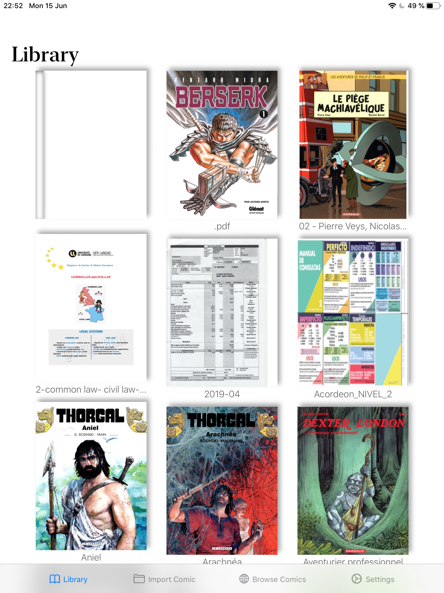

# Lijn
"Bande Dessinée" reader app for iPad, developed using Swift and SwiftUI

## Current state

PDF files open correctly, and the app is able to parse medatada from pdf files or a metadata.opf file created by [Calibre](https://calibre-ebook.com/).
I need to work on CBZ files, and more importantly to address concurrency, parallelism and memory management issues. As of now (23/06/2020), all code is executed on the main thread, and I suppose that there is multiple reference cycles in the app.

## About

Simply put, Lijn is a fancy database for comics in the PDF or CBR/CBZ format. I read lots of Bandes Dessinées on my iPad, and I wanted an app that presents my collection in a beautiful and fast way.

It's my first project, and I will write about it on my [blog](https://bengrina.github.io).

### Goals

The app has to be fast, easy to use, and well designed.

### Dependencies

- [Realm](https://realm.io/)

## Screenshots

Expectation             |  Reality (As of 15/06/20)
:-------------------------:|:-------------------------:
  |  
Initial mockup | Collection View embedded in a Navigation View
